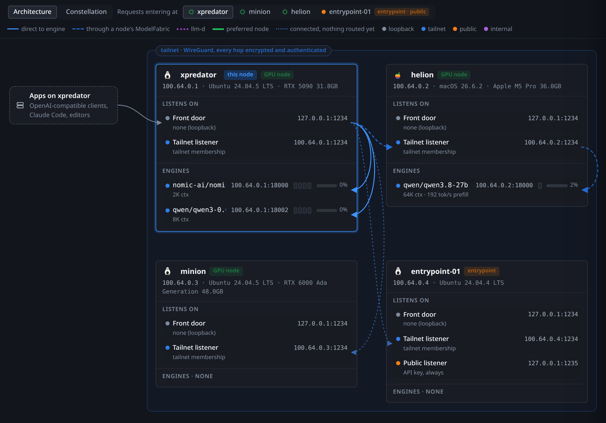
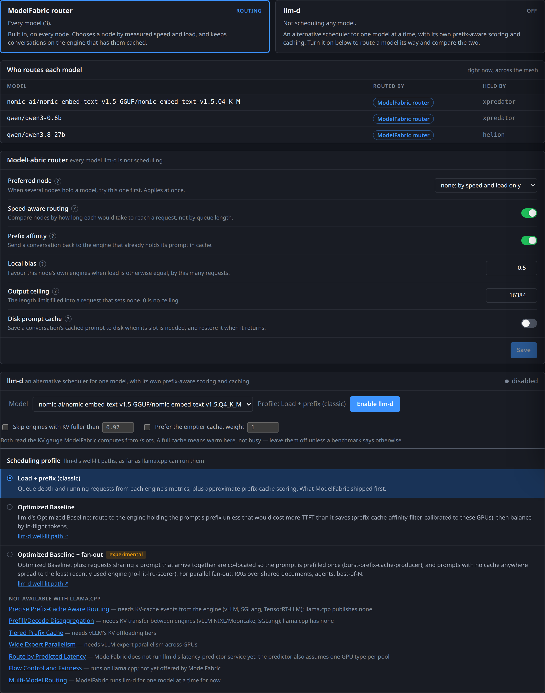
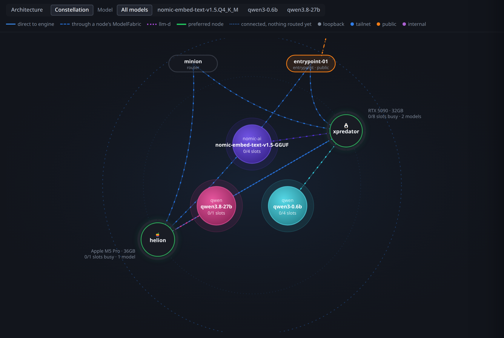
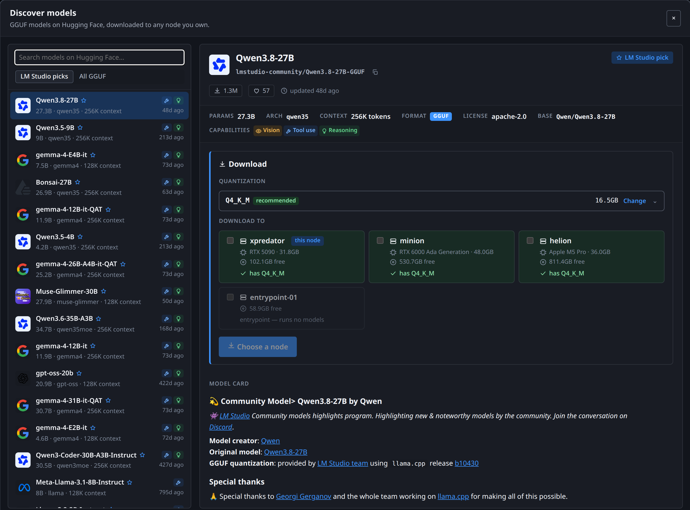
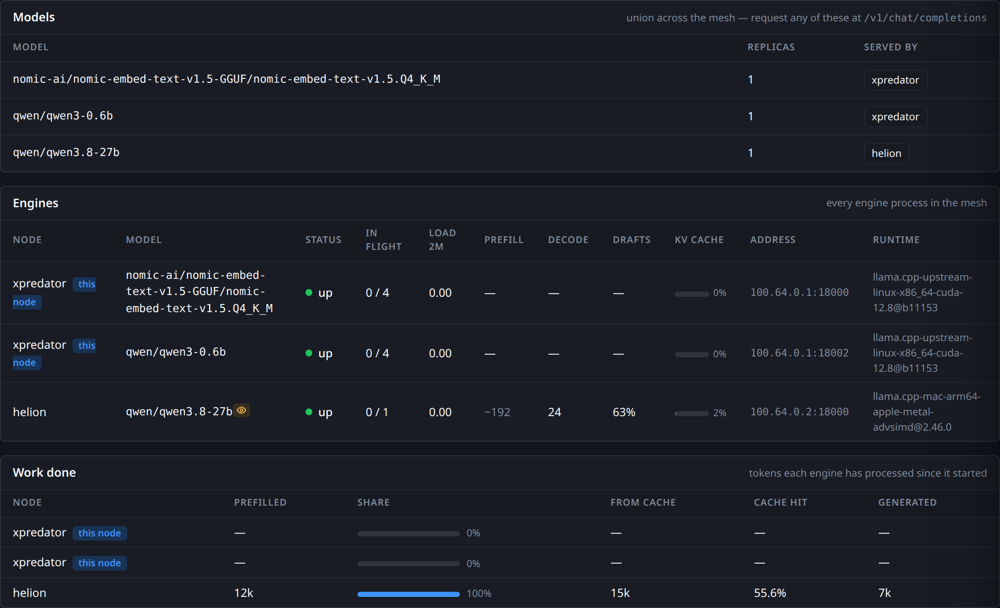
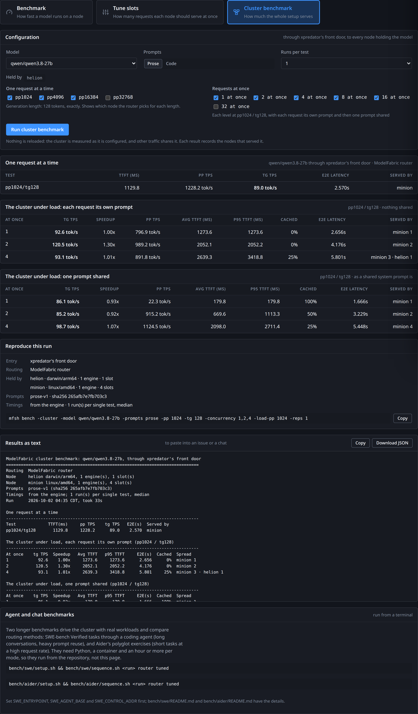

<p align="center">
  
</p>

<h1 align="center">ModelFabric</h1>

<p align="center">
  <b>Every machine serves every model you own.</b><br>
  A peer-to-peer model mesh over <a href="https://tailscale.com">Tailscale</a>: one agent per machine, one address for every app.
</p>

<p align="center">
  <a href="https://github.com/gregbugaj/modelfabric/actions/workflows/ci.yml"></a>
  <a href="https://github.com/gregbugaj/modelfabric/releases/latest"></a>
  <a href="https://pkg.go.dev/github.com/gregbugaj/modelfabric"></a>
  <a href="LICENSE"></a>
</p>

<p align="center">
  <a href="https://modelfabric.sh/docs">Documentation</a> ·
  <a href="https://modelfabric.sh/docs/getting-started">Getting started</a> ·
  <a href="https://modelfabric.sh/docs/api">API</a> ·
  <a href="https://modelfabric.sh/docs/benchmark">Benchmarks</a>
</p>

<p align="center">
  
</p>

I have a workstation with a 5090, an older box with a 6000 Ada, a Mac, and a laptop I work on.
Running a server on each meant remembering which box had which model loaded, and client configs
that hardcoded an IP and broke whenever a model moved. ModelFabric puts one agent on each machine.
Every app points at `localhost:1234` on whatever machine it runs on, and the agent serves the model
itself or forwards the request to a machine that has it.

There is no central server, no control plane and no account. Peers are found by asking the local
`tailscaled` for its peer list and probing each one. A peer that answers is in the mesh.

## Install

```bash
curl -fsSL https://modelfabric.sh/install.sh | sh
```

or straight from the repository, which needs no domain:

```bash
curl -fsSL https://raw.githubusercontent.com/gregbugaj/modelfabric/main/install.sh | sh
```

Detects the platform, downloads the release binary, verifies it against the
release's SHA-256 checksums and installs it to `~/.local/bin`. `MFSH_VERSION`,
`MFSH_INSTALL_DIR` and `MFSH_BASE_URL` override the defaults.

Release binaries also carry build provenance, so you can check one was built by
this repository's workflow rather than uploaded by hand:

```bash
gh attestation verify ~/.local/bin/mfsh -R gregbugaj/modelfabric
```

From source instead (needs Go):

```bash
make build                # or: make dist  (static binaries + checksums.txt for every machine)
mkdir -p ~/.config/modelfabric
cp mfsh.example.json ~/.config/modelfabric/config.json
```

## Quickstart

```bash
mfsh up                                # start the node in the background
mfsh get qwen/qwen3-0.6b               # download a model
mfsh load qwen/qwen3-0.6b              # load it
```

```bash
curl http://localhost:1234/v1/chat/completions \
  -H "Content-Type: application/json" \
  -d '{"model": "qwen/qwen3-0.6b", "messages": [{"role": "user", "content": "Say hi"}]}'
```

The dashboard is at `http://localhost:1234/`. Install the same binary on a second machine on your
tailnet and run `mfsh up` there: both nodes find each other, and either one now answers for the
other's models.

## Features

### One address, every model

Each node serves an OpenAI-compatible API on `localhost:1234` and lists the union of every model in
the mesh. A request for a model another machine holds is forwarded there over the tailnet, and the
response headers say which machine answered.

### Routing that knows the machines differ

The router picks by how long each node would take to reach a request, using measured prefill
rates, so a slow machine is not handed the same share as a fast one. It keeps a conversation on the
engine that already has its prompt cached, falls back to another node if one fails, and takes a
preferred node if you set one. [llm-d](https://llm-d.ai) can schedule a model instead, for
comparison.

<p align="center">
  
</p>

### Dashboard

Compiled into the binary. The Mesh page draws every node, its listeners and engines, live, and the
Constellation view shows the same mesh by model.

<p align="center">
  
</p>

### Model browser and downloader

Search models on Hugging Face, pick a quantization, and download to any node you own.
Each node is shown with its GPU, free disk, and whether it already has the model. Downloads are
verified against the published SHA-256, and a node can copy a model from another node instead of
downloading it again.

<p align="center">
  
</p>

### Engines

ModelFabric starts and stops [llama.cpp](https://github.com/ggml-org/llama.cpp) processes directly,
and [mlx-lm](https://github.com/ml-explore/mlx-lm) on a Mac. No containers. `mfsh runtime get`
installs verified upstream llama.cpp builds and tests each against your GPU first. A mesh can mix
CUDA, Metal and MLX nodes.

### API compatibility

| Endpoint | |
|---|---|
| `POST /v1/chat/completions` | streaming, images, tool use, structured output |
| `POST /v1/responses` | what Codex uses; stored follow-ups and MCP tools |
| `POST /v1/embeddings` | embedding models |
| `POST /v1/messages` | Anthropic-shaped |
| `POST /v1/completions`, `/v1/rerank`, `/v1/audio/transcriptions` | forwarded to the engine |
| `GET /v1/models` | every model in the mesh |
| `POST /api/v1/chat` | LM Studio's native chat: stored conversations and MCP tools |

### Stateful chats and MCP

`/api/v1/chat` and `/v1/responses` keep the conversation for you: send one message, continue from
its response id. Name an [MCP](https://modelcontextprotocol.io) server in the request, or list
servers in `mcp.json`, and the node runs the model's tool calls and returns the answer with a record
of each call. Both MCP switches are off by default.

### Loading and serving

Load and unload models on any node from the dashboard or the CLI, with per-model settings and
presets. Just-in-time loading loads a model when a request names one, and unloads it when idle.
Vision models, speculative decoding with a model's own draft head, and reasoning controls are
supported per load.

<p align="center">
  
</p>

### Benchmarks and slot tuning

`mfsh bench` runs a standard, repeatable benchmark on a node. `mfsh tune` finds how many requests
each machine should serve at once. `mfsh bench -cluster` sends load through the front door and
records which node served each request. All three are in the dashboard, and every result carries
the command that repeats it.

<p align="center">
  
</p>

### Access

Loopback needs no key. Named API tokens, one per app and revocable one at a time, protect a node
when you ask for them. A separate public listener serves inference only, always with a token, for
Tailscale Funnel or a TLS proxy, so a small cloud VM can be the address of the GPUs at home.

### Prompt cache on disk

A conversation's cached prompt can be saved to disk when its slot is needed and restored when it
returns, so a long agent conversation is not read again from scratch. Off by default.

## Architecture

```
app ──► localhost:1234        ◄── the only address anything ever learns
          │
   ┌──────┴───────────────────────────────┐
   │ ModelFabric agent                    │
   │  • OpenAI server (union of models)   │
   │  • peer discovery (tailnet probe)    │
   │  • gossip: models, load              │
   │  • router: locality → least-loaded   │
   └──────┬───────────────────────────────┘
          │ tailnet (WireGuard, already encrypted)
   ┌──────┴──────┬──────────────┐
   ▼             ▼              ▼
gpu-01       gpu-02         entrypoint-01
llama.cpp    llama.cpp      (routes only)
```

Each node asks its engines for `/v1/models` and tells its peers what it holds and how busy it is.
A forwarded request is served by the node that receives it or fails; it is never forwarded again,
so the mesh cannot loop.

## Configuration

Point it at your models and your llama.cpp binary:

```json
{
  "listen": "127.0.0.1:1234",
  "models_root": "/srv/models",
  "llama_server": "llama-server"
}
```

That is enough for ModelFabric to supervise models itself. It can also front engines
you start by hand, which is useful for anything it does not launch:

```json
{
  "engines": [
    { "name": "vllm-gpu0", "base_url": "http://127.0.0.1:8000" }
  ]
}
```

Either way ModelFabric asks each engine for `/v1/models`, so models are never listed
by hand.

## CLI

```bash
mfsh get qwen/qwen3-0.6b                       # download by LM Studio hub id, or any HF repo/URL
mfsh import ./my-model.gguf                    # adopt a GGUF already on disk
mfsh up                    # start the node in the background
mfsh ls                    # models available to load here
mfsh load <model>          # load one (short names resolve if unambiguous)
mfsh ps                    # what is resident in memory
mfsh unload <model|instance-id>  # a key stops every instance of it, or -all
mfsh status                # who is in the mesh, and what they serve
mfsh ops                   # recent load/unload operations
mfsh log                   # stream routed requests (bodies only while capture is on)
mfsh log -tokens           # follow replies as they are generated, on this node
mfsh log -engines          # what every engine in the mesh is doing: rates, slots, cache
mfsh log engine            # an engine's own output: load times, VRAM, warnings
mfsh runtime survey        # hardware, and which engine builds can use it
mfsh runtime get           # install an upstream llama.cpp build for this hardware
mfsh down                  # stop the node
```

## Documentation

The [documentation](https://modelfabric.sh/docs) is the full guide:

- [Getting started](https://modelfabric.sh/docs/getting-started) and [your first model](https://modelfabric.sh/docs/getting-started/first-model)
- [Engines](https://modelfabric.sh/docs/engines), including [MLX on Apple silicon](https://modelfabric.sh/docs/engines/mlx)
- [Model settings](https://modelfabric.sh/docs/models/settings) and [loading models](https://modelfabric.sh/docs/models/load-and-unload)
- [Routing and replicas](https://modelfabric.sh/docs/routing/replicas) and [llm-d](https://modelfabric.sh/docs/routing/llm-d)
- [Dashboard](https://modelfabric.sh/docs/dashboard), [API](https://modelfabric.sh/docs/api) and [API keys](https://modelfabric.sh/docs/api/api-keys)
- [Public entrypoints](https://modelfabric.sh/docs/operations/entrypoint) and [security](https://modelfabric.sh/docs/operations/security)
- [CLI reference](https://modelfabric.sh/docs/reference/cli), [configuration](https://modelfabric.sh/docs/reference/config) and [files and paths](https://modelfabric.sh/docs/reference/paths)

The documentation source lives in `site/`.

## Development

Use Go 1.25 or newer and Node 22 or newer for UI tests:

```bash
make build                 # stages and embeds the current dashboard, writes ./mfsh
make test                  # Go tests with the race detector
make check-ui test-ui      # JavaScript syntax and UI tests
go vet ./...
gofmt -l internal cmd     # should print nothing
```

`make check` runs the project checks together. A rebuilt binary takes effect after the node is
restarted. See the [development guide](https://modelfabric.sh/docs/reference/development).

## Contributing

See [CONTRIBUTING.md](CONTRIBUTING.md). [AGENTS.md](AGENTS.md) covers repository conventions,
testing requirements and instructions for coding agents.

## Security

Report vulnerabilities privately through
[security advisories](https://github.com/gregbugaj/modelfabric/security/advisories/new).
See [SECURITY.md](SECURITY.md) for the trust model and deployment assumptions.

## Licence

[Apache-2.0](LICENSE). ModelFabric installs and supervises binaries from other
projects, each under its own licence; see [NOTICE](NOTICE).

## Acknowledgments

ModelFabric stands on [Tailscale](https://tailscale.com),
[llama.cpp](https://github.com/ggml-org/llama.cpp), [MLX](https://github.com/ml-explore/mlx),
[Hugging Face](https://huggingface.co), [llm-d](https://llm-d.ai) and
[Envoy](https://www.envoyproxy.io). The benchmark's layout follows
[oMLX](https://github.com/jundot/omlx).
